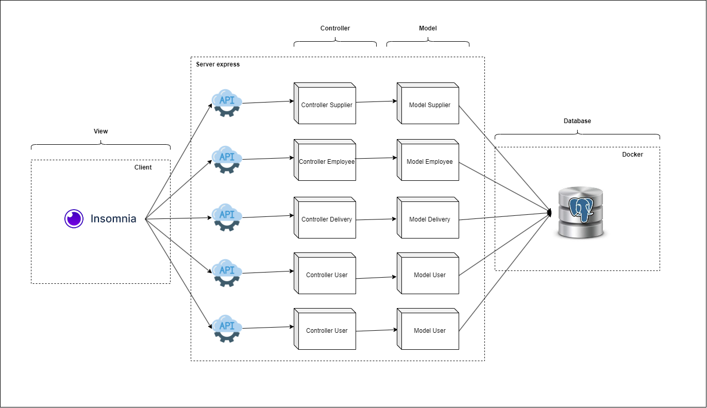
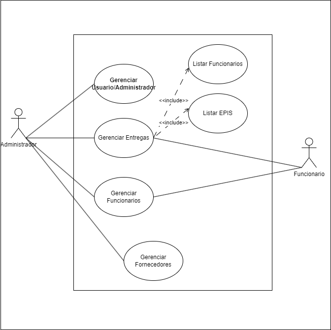
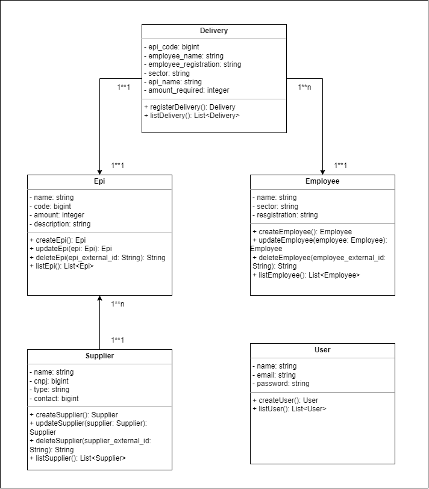
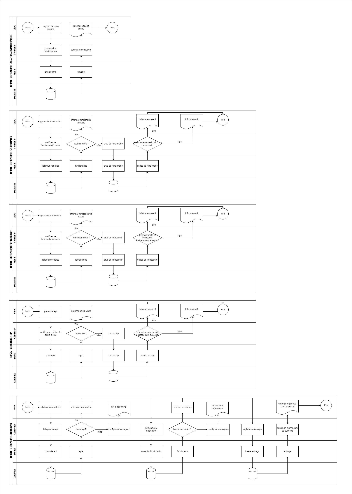

<h1 align="center">GEPI - API</h1>

Sistema Inventário de Gerenciamento de Equipamentos de Proteção Individual (EPIs)

## Tecnologies

## Steps to execute:

> clone o repositório: https://github.com/MarcsGabriel/GEPI-API

~~~node
  npm init
  npx sequelize db:migrate
  npm start
~~~

## Steps to use:

> open your rest request service: **insomnia**, **apidog**, **postman**, **swagger**

> imports a collection: "collection_requests.json"

## Diagrama da API:

</img>

## Diagrama de Casos de Uso:

</img>

## Diagrama de Classes:

</img>

## Diagrama BPMN:

</img>

  <a style="" href="https://github.com/MarcsGabriel">Marcos &#8226;</a>
  <a href="https://github.com/Matheeeeeus">Matheus &#8226;</a>
  <a href="https://github.com/VitinhoPires">Victor &#8226;</a>
  <a href="#">André</a>

